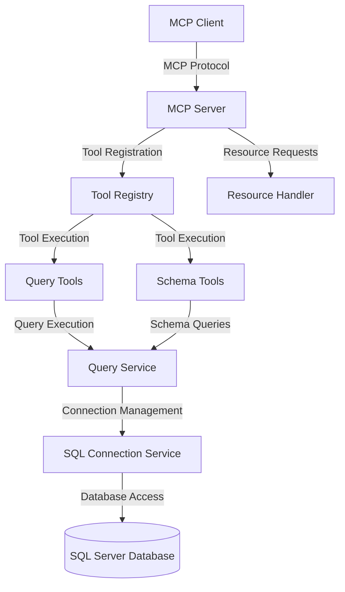
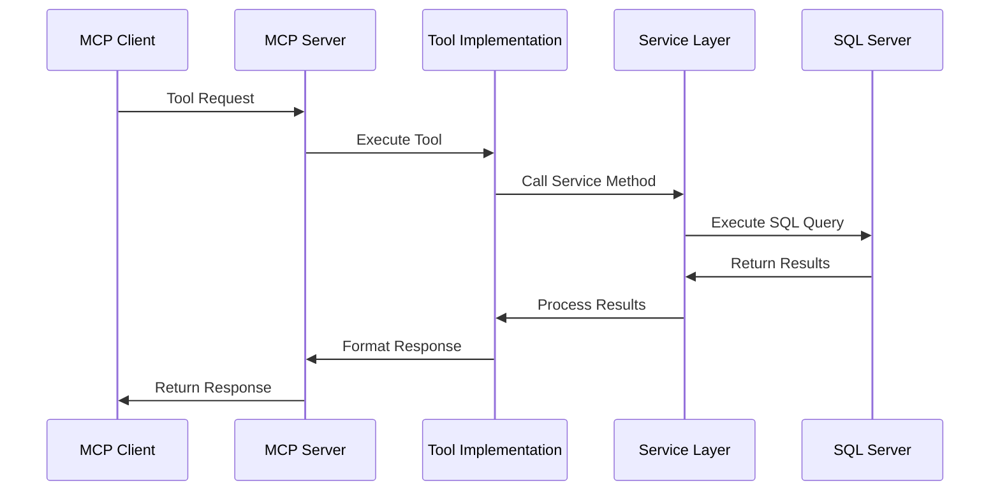

# SQL Server MCP Server

## Project Overview

The SQL Server MCP Server is a specialized application that implements the Model Context Protocol (MCP) to provide Large Language Models (LLMs) with structured access to SQL Server databases. This server acts as a bridge between AI models and database systems, allowing LLMs to perform database operations through a standardized interface.

The primary purpose of this project is to enable AI assistants to:
- Execute SQL queries and retrieve formatted results
- Inspect database schemas (tables, views, stored procedures)
- Perform data manipulation operations (insert, update, delete)

By implementing the Model Context Protocol, this server provides a secure and controlled way for AI systems to interact with databases without requiring direct database access credentials in the AI context.

## Architecture

The SQL Server MCP Server follows a modular architecture that separates concerns between connection management, query execution, and tool exposure.



### Request Flow



## Core Components

### Services

#### SqlConnectionService
The `SqlConnectionService` is responsible for managing database connections. It:
- Parses and validates connection strings
- Creates and manages SQL connections
- Tests connectivity to the database
- Provides database metadata

```csharp
public class SqlConnectionService
{
    // Creates a new SQL connection
    public SqlConnection CreateConnection()
    
    // Tests the database connection
    public async Task TestConnectionAsync()
    
    // Returns database metadata
    public DatabaseInfo GetDatabaseInfo()
}
```

#### QueryService
The `QueryService` handles SQL query execution and result processing. It:
- Executes SQL queries against the database
- Processes query results into structured formats
- Handles different query types (SELECT vs. INSERT/UPDATE/DELETE)
- Manages error handling for query execution

```csharp
public class QueryService
{
    // Executes a SQL query and returns structured results
    public async Task<QueryResult> ExecuteQueryAsync(string query, CancellationToken cancellationToken)
}
```

### Models

#### DatabaseInfo
The `DatabaseInfo` model stores metadata about the connected database:
- Server name
- Database name
- Connection status
- User information
- Connection timestamp

#### QueryResult
The `QueryResult` model represents the result of a SQL query execution:
- Column names
- Row data (as dictionaries)
- Row count
- Success/failure status
- Error messages

### Tools

#### QueryTool
The `QueryTool` class exposes query functionality through the MCP protocol:
- `ExecuteQuery`: Runs a SQL query and returns formatted results
- `ExecuteScalarQuery`: Runs a query and returns only the first value

#### SchemaTools
The `SchemaTools` class provides database schema inspection capabilities:
- `ListTables`: Lists all tables in the database
- `GetTableSchema`: Gets the schema of a specific table
- `ListViews`: Lists all views in the database
- `ListStoredProcedures`: Lists all stored procedures
- `GetDatabaseInfo`: Returns database metadata

### Handlers

#### NoOpResourceHandler
The `NoOpResourceHandler` implements resource handling for the MCP protocol. Currently, it returns empty results as the server focuses on tool-based interactions rather than resource-based ones.

## MCP Integration

The SQL Server MCP Server integrates with the Model Context Protocol through:

1. **Tool Registration**: Tools are registered using the `[McpServerTool]` and `[McpServerToolType]` attributes
2. **Tool Parameters**: Parameters are defined with descriptions for client discovery
3. **Stdio Transport**: The server uses standard input/output for communication
4. **Result Serialization**: Results are serialized to JSON for structured data exchange

The MCP integration allows the server to expose database functionality in a standardized way that AI assistants can discover and use.

## Security Considerations

### Connection String Management
- Connection strings can be provided via command-line arguments or environment variables
- Passwords should not be stored in source code or configuration files
- Production deployments should use secure credential storage

### Authentication Options
- SQL Server authentication with username/password
- Windows authentication (when running locally)
- Azure AD authentication (for cloud deployments)

### Best Practices
- Use the principle of least privilege for database accounts
- Enable TLS/SSL for database connections
- Implement query parameter validation to prevent SQL injection
- Limit the scope of database operations allowed

## Usage Examples

### Running the Server

```bash
# Run with direct connection string
SqlServerMcpServer.exe --dsn "Server=myserver;Database=mydb;User Id=sa;Password=mypassword;TrustServerCertificate=True;"

# Run with connection string from environment variable
SqlServerMcpServer.exe --env-var "SQL_CONNECTION_STRING"

# Run with verbose logging
SqlServerMcpServer.exe --dsn "..." --verbose
```

### Tool Usage Examples

#### Querying Data
```json
{
  "tool": "ExecuteQuery",
  "params": {
    "query": "SELECT TOP 10 * FROM Customers WHERE Region = 'WA'"
  }
}
```

#### Getting Table Schema
```json
{
  "tool": "GetTableSchema",
  "params": {
    "tableName": "Customers"
  }
}
```

#### Listing Database Objects
```json
{
  "tool": "ListTables"
}
```

## Future Enhancements

### Potential Improvements
- Implement caching for schema information to improve performance
- Add transaction support for multi-statement operations
- Implement connection pooling for better resource management

### Additional Tools
- Data import/export tools
- Database backup/restore operations
- Performance monitoring and query analysis
- Stored procedure execution with parameters

### Integration Possibilities
- Integration with Azure OpenAI Service
- Support for additional database systems (MySQL, PostgreSQL)
- Authentication with OAuth/OIDC providers
- Web-based administration interface

## Conclusion

The SQL Server MCP Server provides a powerful bridge between AI systems and SQL Server databases. By implementing the Model Context Protocol, it enables AI assistants to perform database operations in a controlled, secure manner. The modular architecture allows for easy extension and customization, making it adaptable to various use cases and environments.